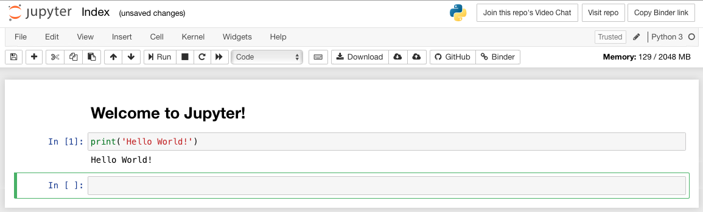

# Head-First Kubernetes

---

## Introduction

This is more-or-less a writeup of a 3-hour workshop we ran at PyConUK2019. The workshop was well received & we wanted to expand on it. Then COVID happened and so we thought we will writeup our thing and put it here as a tutorial.

### Background

Given that this tutorial started as a workshop, it is quite hands-on. You will not find many block diagrams in here. You might not find a lot of paragraphs either.

In a workshop you learn:

- bottom-up instead of top-down
- by tinkering instead of looking at block diagrams
- by doing instead of listening to how it's done

Try and follow along. If you are having problems, [give us a shout](https://github.com/head-first-kubernetes/tutorial/issues/new).

### Learning objectives

This tutorial is squarely aimed at beginners and it is not very ambitious. After working through this, students should be able to do most of the following:

- Demonstrate Kubernetes to their colleagues
- Deploy a web application on Kubernetes
- Manage your deployment e.g. scaling up and down, rolling updates and rollbacks
- Deploy multiple services on Kubernetes
- Describe the Kubernetes API to their colleagues
- Demonstrate `kubectl` for interacting with the Kubernetes API

This thing took 3 intense hours to run as a workshop. Given that this is now a writeup, it might take you longer. Take your time. Take regular breaks. Also take weird segways. Break things. Tear them apart to see how they work. You can always put it back together. Its just software.

### Requirements

Before you get started, make sure you have installed the following on your system:

1. [Docker](https://docs.docker.com/get-docker/)
2. [Python](https://www.python.org/downloads/)
3. [Minikube](https://kubernetes.io/docs/tasks/tools/install-minikube/)

### Hello World API in Python

Lets start with a very simple Hello World API in Python. We will be using Flask.

For those who do not know, Flask is a minimal web framework for Python. The examples in this book will use Flask. In case you are not familiar with Python or Flask, we will walk you through the code. It should be pretty simple and easy to follow.

Following is the code for our simple Hello World web application in Flask followed by a line-by-line walk through.


```python
# hello.py
from flask import Flask

app = Flask(__name__)

@app.route("/")
def hello():
    return "Hello World!"
```

1 - A single-line comment in Python.

2 - Import the Flask object.

4 - Create an object for our web application. `__name__` in Python is bound to the name of the current module which is based on the file name. For this case, the name of our file is `hello.py` so the name of
our module would be "hello".

6 - This is a decorator. In Python decorators are used to hold code that sandwich the code in a function. Decorators are used to annotate functions. For instance, in the following line, we are saying that the hello function should be called whenever the root URL in our web application is hit.

7 - This is how you define a function in Python. Our function returns the famous "Hello World" string.
Like we said the code in the decorator sandwiches the code in our function. We also said that the toast at the top of our sandwich essentially passes control to our function whenever the root of our web application is hit. The toast at the bottom of the sandwich takes whatever the function returns and passes it back to the client that hit the root of our web application.


In order to run this fun little application, we can do the following:

Firstly, we need to install flask. In Python, this is done using pip - which is the Python package manager with a name that Bell Labs would be proud of:  PIP Installs Packages.

We can totally install Flask using pip and get on with the rest of it but that would mean Flask would end up in our global Python packages space.

```console
$ pip install flask
...

$ which flask
/usr/local/bin/flask

$ 🙄
zsh: command not found: 🙄
```

This is fine. Sometimes. But if you are doing a bunch of work in Python, you would end up with 100s and 1000s of packages on your system. Meh.

### Isolating dependencies

The thing that solves this problem is called virtual environments or venv in the Python world.

Virtual environments are cool because they let you install packages on a per-project bases without polluting your global Python installation. Virtual environments are also cool because they come built-in with Python 3.

Did I tell you that we will be using Python 3 in this book? Let me use this opportunity to remind you that Python 2 officially hit its end of life in April 2020  👻

So firstly, lets create a virtual environment for our little Hello World project. You can do it like so:

```console
$ python -m venv ~/<path-to-the-virtual-environment>
```

I usually go with:

```console
$ python -m venv ~/.venv/k8s
```

P.S. You can run many modules in Python by using the -m flag. I will come back to this shortly.

A virtual environment is nothing but a copy of all the files that are needed to run Python applications. You can see for yourself:

```console
$ ls ~/.venv/k8s
drwxr-xr-x   6 alixedi  staff   192B Jul 31 13:01 .
drwxr-xr-x  36 alixedi  staff   1.1K Jul 31 13:01 ..
drwxr-xr-x  12 alixedi  staff   384B Jul 31 13:01 bin
drwxr-xr-x   2 alixedi  staff    64B Jul 31 13:01 include
drwxr-xr-x   3 alixedi  staff    96B Jul 31 13:01 lib
-rw-r--r--   1 alixedi  staff    75B Jul 31 13:01 pyvenv.cfg
```

Or more interestingly:

```console
$ ls ~/.venv/k8s/bin
-rw-r--r--  1 alixedi  staff  2244 Jul 31 13:01 activate
-rw-r--r--  1 alixedi  staff  1300 Jul 31 13:01 activate.csh
-rw-r--r--  1 alixedi  staff  2452 Jul 31 13:01 activate.fish
-rwxr-xr-x  1 alixedi  staff   281 Jul 31 13:01 easy_install
-rwxr-xr-x  1 alixedi  staff   281 Jul 31 13:01 easy_install-3.7
-rwxr-xr-x  1 alixedi  staff   263 Jul 31 13:01 pip
-rwxr-xr-x  1 alixedi  staff   263 Jul 31 13:01 pip3
-rwxr-xr-x  1 alixedi  staff   263 Jul 31 13:01 pip3.7
lrwxr-xr-x  1 alixedi  staff     7 Jul 31 13:01 python -> python3
lrwxr-xr-x  1 alixedi  staff    22 Jul 31 13:01 python3 -> /usr/local/bin/python3
```

We can spot the whole cast in there including the python binary and pip.

Now in order to "activate" this virtual environment, we have - the activate script. Did you spot that in the last code snippet? Well done 👏

Here is how you activate a virtual environment:

```console
$ source ~/.venv/k8s/bin/activate
(k8s) $ wow!
zsh: command not found: wow!
```

😬

Right. Now that we have the virtual environment set up, we can install flask in it without polluting our global Python installation.

Here is how you would do it:

```console
(k8s) $ pip install flask
...
Installing collected packages: MarkupSafe, Jinja2, Werkzeug, click, itsdangerous, flask
Successfully installed Jinja2-2.11.2 MarkupSafe-1.1.1 Werkzeug-1.0.1 click-7.1.2 flask-1.1.2 itsdangerous-1.1.0
```

In order to check if our virtual environment is doing what it said on the tin. Or what I said on the tin:

```console
(k8s) $ which python
~/.venv/k8s/bin/python
```

To double check:

```console
(k8s) $ python
Python 3.7.4 (default, Oct 12 2019, 18:55:28)
[Clang 11.0.0 (clang-1100.0.33.8)] on darwin
Type "help", "copyright", "credits" or "license" for more information.
>>> import flask
>>> awesome!
File "<stdin>", line 1
    awesome!
           ^
SyntaxError: invalid syntax
```

(Sorry again)

One final check. Installing flask in a venv would mean that its is not available globally:

```console
(k8s) $ deactivate

$ which python
/usr/local/bin/python3

$ python
..
>>> import flask
Traceback (most recent call last):
  File "<stdin>", line 1, in <module>
ModuleNotFoundError: No module named 'flask'
```

ModuleNotFoundError. Music to me ears  🕺

Onwards. Flask. Web application.

We wrote ourselves an exciting little application in Flask. We should totally run it. Here is how:

```console
(k8s) $ FLASK_APP=hello.py flask run
* Serving Flask app "hello.py"
* Environment: production
  WARNING: This is a development server. Do not use it in a production deployment.
  Use a production WSGI server instead.
* Debug mode: off
* Running on http://127.0.0.1:5000/ (Press CTRL+C to quit)
```

Looks promising. Lets see if it works. In a different terminal:

```python
$ curl localhost:5000
Hello World!
```

wOot!  🙌

I managed to write my excitement in the right window this time 💪

### Distributing our application

Before I move to containers and specifically Docker containers, I want to press home my advantage and introduce one more little magic trick in pip.

So doing a pip install <awesome-package> is nice and all for development but what if you want to distribute your application?

Wait what? We just cobbled together a Hello World and now we are distributing it? What exactly is distribute anyway? Why is it cool?

Well, I agree that our little Hello World thing is not going to get into ycombinator or anything but its still a fully functional - albeit dumb - web application.

The thing with web applications - like all applications - is that they need to be chucked around fairly often. For instance:

1. You might want to put our Hello World application in a code repository like GitHub. Every time someone in your team adds a little feature to it, you might want to run some tests using e.g. GitHub actions. This is called Continuous Integration (CI) and it's all the rave. Now in order to run tests on your application, GitHub actions would need to be able to easily install it - along with all its dependencies no?

2. Once you have them features working, you might want to release the latest version of your application to your users. Generally, for web applications, this would mean putting them on a server. Same story here. On the server you would need to reproduce the environment that your web application needs in order to run. AKA install.

3. You got 2 new junior engineers on your team. They need to quickly and easily be able to run your massively complex Hello World application on their local machine in order to build new features and get you that VC 💰

Luckily, pip has a trick or two up its sleeve that lets us reproduce the environment needed by our web application in order to run.

We can do this in 2 easy steps.

In the first step, we will capture the dependencies required by our web application.

```console
(k8s) $ pip freeze
click==7.1.2
Flask==1.1.2
itsdangerous==1.1.0
Jinja2==2.11.2
MarkupSafe==1.1.1
Werkzeug==1.0.1

```

This gives us a list of all the dependencies and their correct versions that are installed in our virtual environment right now.

Lets put these in a file like so:

```console
(k8s) $ pip freeze > requirements.txt
```

Now that our dependencies are in a file, we can commit this to the repository along with the code and voila! we have taken our first step to enable the distribution of our web application to the CI, the server and other developers.

Anything or anyone who wants to run our web application should be able to do so by following some simple steps:

```console
$ # Clone the repo and CD into it
$ git clone k8s
$ cd k8s

$ # Create a new venv and activate it
$ python -m venv ~/.venv/k8s
$ source ~/.venv/k8s/bin activate

$ # Install required packages into the venv
$ pip install -r requirements.txt

$ # Run that thing!
$ FLASK_APP=hello.py flask run
```

You can put these steps in a console script and it would work beautifully. More or less. Until it doesn't.

Time to talk about sandboxes.

### Sandboxes

A little reminder of what a Python virtual environment is.

```console
$ ls ~/.venv/k8s
drwxr-xr-x   6 alixedi  staff   192B Jul 31 13:01 .
drwxr-xr-x  36 alixedi  staff   1.1K Jul 31 13:01 ..
drwxr-xr-x  12 alixedi  staff   384B Jul 31 13:01 bin
drwxr-xr-x   2 alixedi  staff    64B Jul 31 13:01 include
drwxr-xr-x   3 alixedi  staff    96B Jul 31 13:01 lib
-rw-r--r--   1 alixedi  staff    75B Jul 31 13:01 pyvenv.cfg
```

It is a directory containing all the Python dependencies that are needed to run a Python application. This includes the python binary, pip etc.

```console
$ ls -l ~/.venv/k8s/bin
total 72
-rw-r--r--  1 alixedi  staff  2244 Jul 31 13:01 activate
..
-rwxr-xr-x  1 alixedi  staff   263 Jul 31 13:01 pip
..
lrwxr-xr-x  1 alixedi  staff     7 Jul 31 13:01 python -> python3
```

It also includes the packages that are needed by our application e.g. Flask:

```console
$ ls -a ~/.local/share/virtualenvs/head-1st-k8s/lib/python3.7/site-packages
drwxr-xr-x  21 alixedi  staff   672B Jul 31 13:09 .
drwxr-xr-x   3 alixedi  staff    96B Jul 31 13:01 ..
drwxr-xr-x   9 alixedi  staff   288B Jul 31 13:09 Flask-1.1.2.dist-info
drwxr-xr-x   9 alixedi  staff   288B Jul 31 13:09 Jinja2-2.11.2.dist-info
drwxr-xr-x   8 alixedi  staff   256B Jul 31 13:09 MarkupSafe-1.1.1.dist-info
drwxr-xr-x   8 alixedi  staff   256B Jul 31 13:09 Werkzeug-1.0.1.dist-info
..

```

Its kind of like a sandbox. Sandboxes are a cool idea. Like most cool ideas, the sandbox idea increases in awesomeness if we turn it all the way up to 10.

This is what containers do. Well not all the way up to 10. That would be virtual machines. Maybe all the way to 8.

First, lets talk about why.

While putting the packages that our application needs (aka dependencies) to run in a directory so that we can distribute our application easily has been really cool.

But we are still in a half-way house here.

You see the copy of the python binary we spotted in the bin folder in our virtual environment still needs a bunch of operating system libraries to run. If you are running a Linux machine, you can observe this like so:

```console
(k8s) $ strace -s 2000 -o strace.log python
Python 3.7.4 (default, Oct 12 2019, 18:55:28)
[Clang 11.0.0 (clang-1100.0.33.8)] on darwin
Type "help", "copyright", "credits" or "license" for more information.
>>> exit()

(k8s) $ cat strace.log | head -n 10
execve("/home/alixedi/k8s/bin/python", ["python"], 0x7ffee2a890b0 /* 24 vars */) = 0
brk(NULL)                               = 0xc01000
access("/etc/ld.so.nohwcap", F_OK)      = -1 ENOENT (No such file or directory)
access("/etc/ld.so.preload", R_OK)      = -1 ENOENT (No such file or directory)
openat(AT_FDCWD, "/etc/ld.so.cache", O_RDONLY|O_CLOEXEC) = 3
fstat(3, {st_mode=S_IFREG|0644, st_size=17010, ...}) = 0
mmap(NULL, 17010, PROT_READ, MAP_PRIVATE, 3, 0) = 0x7f8719d60000
close(3)                                = 0
access("/etc/ld.so.nohwcap", F_OK)      = -1 ENOENT (No such file or directory)
openat(AT_FDCWD, "/lib/x86_64-linux-gnu/libc.so.6", O_RDONLY|O_CLOEXEC) = 3
```

So while the Python virtual environment provides nice isolation within the Python universe, it is still relies on being able to make a bunch of calls to operating system libraries (syscalls) that are not bundled inside the virtual environment.

Not quite a sandbox then is it?

## Docker

### Introduction

This is where containers come in.

Containers provide a sandbox for your process to run in. This sandbox is to Python virtual environment sandbox what Beyonce is to Britney Spears.

Specifically:

- Containers provides file system isolation. A process running in a container cannot access the file system outside of the container.
- Containers provide memory and CPU usage isolation. A process running in a container can only access the memory and CPU that has been assigned to it.
- Container provide namespace isolation i.e. network, process IDs, hostnames, users etc.
- Containers provide security. A process running in a container can only do what it has been permitted to do.

Finally, Docker is a type of a container. The most popular one no less. It also comes with a bunch of nice-to-haves which makes it easy for beginners.

Enough talk. Lets create our first container. Who is excited?  ✋

The first thing we need to do is to write the Docker equivalent of our requirements.txt file i.e. a file that lay out what would go into our container. Standard naming convention dictates that we call this file Dockerfile.

A very basic Dockerfile for our application would look like the following:

```docker
FROM python:alpine
COPY hello.py requirements.txt /
RUN pip install -r requirements.txt

```

1 - Every docker container has a base image (More on images in the following paras). It is specified using the FROM keyword on the first line of the Dockerfile. Python.org conveniently publishes a bunch of base images that we can use to run Python applications. We are using the python base image with the tag `alpine`. This would give us a Python environment running on Alpine Linux - a light-weight distribution that is popular in the container world.

2 - This copies our files to the root of our container.

3 - This is pretty standard pip and we have already covered it. The only interesting thing here is that we are choosing not to use venv. We totally can but it will be like running an environment inside a more awesome environment so no need.

The attentive reader might ask:

Hang on a minute, we are moving straight to requirements.txt

What happened to being able to create a virtual environment by running:

```console
$ python -m venv ~/.venvs/k8s
```

Followed by activating the virtual environment and installing a bunch of packages by:

```console
$ source ~/.venv/k8s/bin/activate
(k8s) $ pip install flask
```

To which, the clever 🙇 writer would say:

1. Good question.
2. Python venv as the analogy for Docker died as soon as we moved from the What (isolation) to the How (API).


Docker has its own opinions on sandboxes, how they should be built and how processes should be run inside them.

Some of these opinions are informed by the difference in nature of a docker sandbox to a Python venv sandbox.

The clever writer would then move on swiftly to Docker concepts and hope that the analogy with Python venv has caused more good than harm.

### Images

Back to Dockerfiles. We have one. What do we do with it?

Without any obvious exceptions, the most awesome thing you could do with a Dockerfile is to use it to produce a Docker image.

What is a Docker image?

It is a tarball that contains all the dependencies needed to run your application.

The act of building a Docker image, among other things, downloads these dependencies from the inter webs onto your machine.

How do you build a docker image?

Simple. Like so:

```console
$ docker build .

Sending build context to Docker daemon  5.632kB

Step 1/3 : FROM python:alpine
alpine: Pulling from library/python
df20fa9351a1: Pull complete
36b3adc4ff6f: Pull complete
3e7ef1bb9eba: Pull complete
78538f72d6a9: Pull complete
c9fdb169601a: Pull complete
Digest: sha256:1edaccf11f061da18842e3cb7bb14d9f7336b6b2a24248219ab5c363b8454336
Status: Downloaded newer image for python:alpine
 ---> 872c3118ec53

Step 2/3 : COPY hello.py requirements.txt /
 ---> 70bd00cce758

Step 3/3 : RUN pip install -r requirements.txt
 ---> Running in 9527747772b7
Collecting click==7.1.2
  Downloading click-7.1.2-py2.py3-none-any.whl (82 kB)
Collecting Flask==1.1.2
  Downloading Flask-1.1.2-py2.py3-none-any.whl (94 kB)
Collecting itsdangerous==1.1.0
  Downloading itsdangerous-1.1.0-py2.py3-none-any.whl (16 kB)
Collecting Jinja2==2.11.2
  Downloading Jinja2-2.11.2-py2.py3-none-any.whl (125 kB)
Collecting MarkupSafe==1.1.1
  Downloading MarkupSafe-1.1.1.tar.gz (19 kB)
Collecting Werkzeug==1.0.1
  Downloading Werkzeug-1.0.1-py2.py3-none-any.whl (298 kB)
Building wheels for collected packages: MarkupSafe
  Building wheel for MarkupSafe (setup.py): started
  Building wheel for MarkupSafe (setup.py): finished with status 'done'
  Created wheel for MarkupSafe: filename=MarkupSafe-1.1.1-py3-none-any.whl size=12629 sha256=7020159b31f20b65caec66087f40ff4a4e235219689d8235bbbc8b5187ef717d
  Stored in directory: /root/.cache/pip/wheels/0c/61/d6/4db4f4c28254856e82305fdb1f752ed7f8482e54c384d8cb0e
Successfully built MarkupSafe
Installing collected packages: click, Werkzeug, MarkupSafe, Jinja2, itsdangerous, Flask
Successfully installed Flask-1.1.2 Jinja2-2.11.2 MarkupSafe-1.1.1 Werkzeug-1.0.1 click-7.1.2 itsdangerous-1.1.0

Removing intermediate container 9527747772b7
 ---> 1ddb10e93851

Successfully built 1ddb10e93851
```

I have put new lines in the snippet above to distinguish the various steps that were needed for building our docker image.

An attentive reader would notice that the steps correspond to the lines in the Dockerfile. Well done attentive reader. Hold that thought. We will revisit this pretty soon.

### Tags

Back to the image. We just built one. Where is it though?

```console
$ docker images
REPOSITORY          TAG                 IMAGE ID            CREATED             SIZE
<none>              <none>              1ddb10e93851        4 minutes ago       53.4MB
python              alpine              872c3118ec53        2 days ago          42.7MB
```

Hmm. That is not very helpful.

The python image sort of makes sense. I specified it as a base image in my Dockerfile. I presume when I built my image, it got downloaded.

But what about MY image? It doesn't seem to have a REPOSITORY (seems like a name) or a TAG. And what is even a tag anyway?

Lets answer these questions by running the following bit of command-line:

```console
$ docker image tag 1ddb10e93851 hello:v1
$ docker images
REPOSITORY          TAG                 IMAGE ID            CREATED             SIZE
hello               v1                  1ddb10e93851        11 minutes ago      53.4MB
python              alpine              872c3118ec53        2 days ago          42.7MB
```

Much better.

Except next time, we could bundle up the naming and tagging in the build command itself:

```console
$ docker build --tag hello:v1 .
```

Now that we know HOW to name and tag our images, its probably useful to understand WHY.

One popular WHY is versions. Learn to take a hint? hello:v1  😉

Imagine a world where every time you release a new version of your app, you build an image and push it to an image-store of sorts.

You would need someway to differentiate hello 1.0 with hello 2.0.

One way to do it would be to name the images hello1 and hello2 respectively.

A better way would be to name the images hello and tag them v1 and v2 respectively.

In docker world, you would refer to these as hello:v1 and hello:v2.

You can also assign multiple tags to an image.

For instance, imagine you test your application in a staging environment before promoting it to production. In this case, it is common to tag the image as staging when it is published. Once you are happy that the thing works, you can assign a production tag to it.

P.S. Assigning staging and production tags wouldn't automatically deploy your application to staging and production environment respectively. There is a missing piece here. We will come back to it when we talk about Kubernetes.

### Repositories

I started on this spiel of names and tags; Conveniently ignoring a small but important detail: There is no name. Its actually repository. Its time we smooth this out.

Now that we know how to build an image, its time to revisit why we started on this path in the first place. We wanted some way to distribute our application in a reproducible way.

Building an images is a strong start but that doesn't quite solve the distribute bit. This is where repositories come in. A repository is a central store for your images. There are several options but for the purpose of learning about repositories, we would run with dockerhub.

Go make an account at Dockerhub. While you are at it, also create a new repository. You can call it hello.

Done? Cool. We can now do the following:

```console
$ docker image tag hello:v1 <dockerhub-username>/hello:v1
$ docker push alixedi/hello:v1
The push refers to repository [docker.io/alixedi/hello]
b36cb4db8a04: Pushing [=============>                                     ]   2.84MB/10.76MB
fa9b430b6d13: Pushing [==================================================>]  3.072kB
2e628e2d9dc4: Pushing [==================>                                ]  2.693MB/7.236MB
26e08b3268b4: Pushing [==================================================>]  4.608kB
adf6e7b1c68f: Pushing [======>                                            ]  3.643MB/29.33MB
408e53c5e3b2: Waiting
50644c29ef5a: Waiting
```

This will push the hello:v1 image to dockerhub.

The CI script that deploys your application to production could then do the following:

```console
$ docker pull alixedi/hello:v1
```

With a sensible combination of repositories, tags, dockerhub, push and pull, you have just sorted the distribution of your app.

Phew.

But also I realise that we haven't actually run the damned thing yet!

### Layers

We could run it now but I am inclined to shamelessly double down on the BS and introduce one more concept before that.

This one has been there all along. Looming in the shadows. I have been  trying to hold off explaining it. Until now. I am left with no choice. Sorry.

Each instruction in a Dockerfile produces a layer. This layer is a diff of changes in the filesystem from the previous layer. A docker image is a stack of these layers.

One more thing: All the commands produce layers but except for FROM, COPY and RUN, the layers are intermediate. Intermediate layers are squashed in the resulting image.

Finally, how can I inspect these layers? Lets do that now. Break the COPY statement in your Dockerfile:

```console
FROM python:alpine
COPY hello.py /
COPY requirements.txt /
RUN pip install -r requirements.txt
```

Build a new version of the image:

```console
$ docker build -t hello:v2 .
```

In order to inspect the layers:

```console
$ docker history hello:v2
IMAGE               CREATED             CREATED BY                                      SIZE                COMMENT
5433ece6bdd7        9 minutes ago       /bin/sh -c pip install -r requirements.txt      10.8MB
a320b983dea1        9 minutes ago       /bin/sh -c #(nop) COPY file:11d578baaa9f1fd5…   95B
57d793585c4c        9 minutes ago       /bin/sh -c #(nop) COPY file:35f7847638831fbf…   106B
872c3118ec53        2 days ago          /bin/sh -c #(nop)  CMD ["python3"]              0B
<missing>           2 days ago          /bin/sh -c set -ex;   wget -O get-pip.py "$P…   7.24MB
..
```

And compare the layers with those of hello:v1

```console
$ colordiff <(docker history hello:v1) <(docker history hello:v2)
2,3c2,4
< 1ddb10e93851        3 hours ago         /bin/sh -c pip install -r requirements.txt      10.8MB
< 70bd00cce758        3 hours ago         /bin/sh -c #(nop) COPY multi:63205105974020a…   201B
---
> 5433ece6bdd7        11 minutes ago      /bin/sh -c pip install -r requirements.txt      10.8MB
> a320b983dea1        11 minutes ago      /bin/sh -c #(nop) COPY file:11d578baaa9f1fd5…   95B
> 57d793585c4c        11 minutes ago      /bin/sh -c #(nop) COPY file:35f7847638831fbf…   106B
```

Finally, all these layers are not for nothing. Each layer can be re-used by an unlimited number of images. Also, when you are building a new image, Docker is smart enough to only download layers that are not present in the local file system.

Alright, I am now satisfied that we have touched most of the bits in docker that matter.

### docker run

Time to run that fucking image.

First thing you could do is to run your container with a shell and faff about:

```console
$ docker run --interactive --tty hello:v1 sh
```

I would also invite you at this point to summon the help and find out what —interactive and —tty means:

```console
$ docker run --help
```

Nice innit? You would be delighted to find out that this help is not limited to docker run.

```console
$ docker --help
$ doker build --help
$ docker image --help
$ etc.
zsh: command not found: etc.
```

😐

Back to docker run. Lets try and faff about as promised:

```console
$ docker run -it hello:v1 sh
# ls -l -Sr
total 68
dr-xr-xr-x   12 root     root             0 Aug  7 13:16 sys
dr-xr-xr-x  144 root     root             0 Aug  7 13:16 proc
-rw-r--r--    1 root     root            95 Aug  7 09:30 requirements.txt
-rw-r--r--    1 root     root           106 Jul 10 10:14 hello.py
..
```

I see them files and I cannot resist:

```console
# FLASK_APP=hello.py flask run &
 * Serving Flask app "hello.py"
 * Environment: production
   WARNING: This is a development server. Do not use it in a production deployment.
   Use a production WSGI server instead.
 * Debug mode: off
 * Running on http://127.0.0.1:5000/ (Press CTRL+C to quit)

# python
Python 3.8.5 (default, Aug  4 2020, 04:11:56)
[GCC 9.3.0] on linux
Type "help", "copyright", "credits" or "license" for more information.
>>> import urllib.request
>>> urllib.request.urlopen('http://127.0.0.1:5000').read()
127.0.0.1 - - [07/Aug/2020 13:22:43] "GET / HTTP/1.1" 200 -
b'Hello World!\n'
```

There it is 😅

Now we just want to lift up whatever we did in that container to get our little app running. Here is a decent first go:

```console
$ docker run hello:v1 sh -c "FLASK_APP=hello.py flask run"
 * Serving Flask app "hello.py"
 * Environment: production
   WARNING: This is a development server. Do not use it in a production deployment.
   Use a production WSGI server instead.
 * Debug mode: off
 * Running on http://127.0.0.1:5000/ (Press CTRL+C to quit)
```

Now wouldn't it be fun if we can get that beautiful Hello World back? I am one for trying:

```console
$ curl localhost:5000
curl: (7) Failed to connect to localhost port 5000: Connection refused
```

There are 2 bits missing here I suspect:

1. The host should not be able to access the [localhost](http://localhost) for a container. This can be easily fixed by running our app on 0.0.0.0
2. We need some way to forward a port from our host to the container.

Lets see if you can find out how to map ports from the host to the container?

```console
$ docker run --help | grep port
      --expose list                    Expose a port or a range of ports
      --health-retries int             Consecutive failures needed to report unhealthy
  -p, --publish list                   Publish a container's port(s) to the host
  -P, --publish-all                    Publish all exposed ports to random ports
```

Looks promising. Lets try the publish bit:

```console
$ docker run -p 5000:5000 hello:v1 sh -c "FLASK_APP=hello.py flask run -h 0.0.0.0"
```

Moment of truth 🤞

```console
$ curl localhost:5000
Hello World!
```


Now then 🚀

I am taking it as a win but lets be honest. This is a bit of a mouthful:

```console
$ docker run -p 5000:5000 hello:v1 sh -c "FLASK_APP=hello.py flask run -h 0.0.0.0"
```

I wonder if we could do something about it?

### Dockerfile

Turns out we could. Remember that old Dockerfile? Yup. You can totally move a bunch of things in this tedious command line into the Dockerfile.

For starters, you could set environment variables. In addition, you could also specify the command to run when a container is spawned.

Here is how:

```console
FROM python:alpine
COPY hello.py requirements.txt /
RUN pip install -r requirements.txt
ENV FLASK_APP=/hello.py
CMD ["flask", "run", "-h", "0.0.0.0"]
```

Lets build and run this baby:

```console
$ docker build -t hello:v3 .
$ docker run -p 5000:5000 hello:v3
```

And:

```console
$ curl localhost:5000
Hello World!
```


I hope this was fun.

We started with a little Hello World application in Python, introduced Python's virtual environment to make our application **reproducible** and **distributable** (I am actually surprised this is a word).

We then ventured into containers, specifically Docker. We touched upon docker images and how to build them. Finally, we talked about how to run our application inside docker containers.

Using a Hello World application was a bit of a necessity because we wanted complete attention on the container and not what was running inside it. I think we managed to do that but we do not intend to keep at it.

### A new API: Python web console

For the rest of this book, we want to work on with a proper, real-world (ish) application. This would require some investment e.g. digression into Python nitty gritty. We hope that this investment will pay dividends in your understanding and confidence when it comes to apply things that you learn here to your own projects.

Here we are then. We spent a lot of time trying to choose an application that would allow us to exercise most of the important bits in Kubernetes. We chose to build an interactive Python web console - A webpage that lets users type and run arbitrary Python code.

There are plenty of examples of this in the wild:

* [Jupyterhub](https://jupyter.org/try)
* [Kaggle](https://www.kaggle.com/)
* [Google Colab](https://colab.research.google.com/)
* [Python's homepage](https://www.python.org/)

Jupyterhub, for instance, is open source software. You can install and run it locally. It looks like this:



Making an interactive Python web console might sounds complicated but we will be doing it one step at a time and we get a nice helping hand from Python:

```python
from code import InteractiveConsole
console = InteractiveConsole()

inp = True
while inp:
    inp = input('>>> ')
    console.runcode(inp)
```

In less than 10 lines of code, we have something that behaves like a primitive Python command line:

```python
>>> print('Hello World')
Hello World
>>> a = 1 + 2
>>> print(a)
3
```

We can easily combine this with our Docker hello world example and we have a (multi-user) interactive web console. The following little mini application can actually build with the same docker file from the previous chapter:

```python
import code
import io
import contextlib
import signal

import flask

app = flask.Flask(__name__)

app.consoles = {}

class WebConsole:

    def __init__(self):
        self.console = code.InteractiveConsole()

    def run(self, code):
        output = io.StringIO()
        with contextlib.redirect_stdout(output):
            with contextlib.redirect_stderr(output):
                for line in code.splitlines():
                    self.console.push(line)

        return {'output': str(output.getvalue())}

@app.route('/api/<uname>/run/', methods=['POST'])
def run(uname):
    if not uname in app.consoles:
        app.consoles[uname] = WebConsole()
    return flask.jsonify(
        app.consoles[uname].run(
            flask.request.get_json()['input']
        )
    )

def shutdown_server():
    raise RuntimeError('Shutdown')

@app.route('/api/crash/', methods=['GET'])
def crash():
    shutdown_server()

# We want Flask to shutdown when requested
signal.signal(signal.SIGTERM, shutdown_server)
```

Ok, you got me there. I was lying, this is not a full web app. We won't actually build the front end, just the JSON api which would power it. We think that this would be enough for the purpose of learning Kubernetes.

Let's wrap this in an image and run it. You can use the last Dockerfile for this. Just replace `hello.py` with `webconsole.py`:

```console
$ docker build -t webconsole:v1 .
$ docker run -p 5000:5000 webconsole:v1
```

A little demonstration on how to use it from a python script (pip install a handy package called `requests` first):

```python
import requests
print(requests.post(
    'http://localhost:5000/api/ali/run/',
    json={'input': 'print("Hello World")'}
).json())
```

Of course this is far too simple. As always with development, having a proof of concept, is nothing compared to actually creating something you can run on production. Not to mention: you are allowing anyone to run any code on your servers! I'm sure that if you leave this running for a day, your application pissed of a lot of all of your users, and someone managed to get access to your server.


As this book is about Kubernetes we will address most of these issue with Kubernetes. We will introduce you to everything you need to run most applications on Kubernetes, and even use some of it's advanced features.

## Kubernetes

### Introduction

When I started writing this in my head, I decided that I will not go into too much details about the why of Kubernetes.

You - the reader - are reading this tutorial so it is a fair assumption on my part that you have figured out your whys, and they are all lined up like:  🦆 🦆 🦆

On the other hand, having just written the chapter on Docker, half of which - to be honest - was expanding on why, I feel uncomfortable in stopping short of putting down something on the why of Kubernetes.

I feel that my main job, as an author, is to get the readers excited about something because lets face it: Excitement leads to motivation. Motivation leads to action. Action lead to Stack Overflow. which does a far better job of solving any specific issues that you might run into during the course of your actions.

There are two possible whys of Kubernetes.

#### Big Corp Kubernetes

You work at a company that has implemented some kind of microservices architecture. Possibly, promulgating an engineering culture where the respective teams oversee particular features of the broader application from conception, design, development, all the way into production.

You are a junior developers hired because you traversed that f**king binary tree on the whiteboard in 5 minutes of sharpie-ballet. Well done for the gumption to read CTCI. Twice. Now that you are in, you want to get cracking.

Your CTO - in his/her infinite wisdom - have chosen to use Kubernetes to orchestrate all those microservices.

Orchestrate is a word that is used often to describe Kubernetes. Lets nail down what that means before we move on with the rest of our story.


Orchestration in the context of Big Corp running a microservices architecture means 3 main things:

##### Service Discovery

Containers are meant to be ephemeral. Like cattle and not like pets.

A set of containers that are running a particular microservice need a PO box - A layer of abstraction over the (IP) addresses of individual containers.

The abstraction would mean that the containers could ephemeral all they like and the rest of the cluster wouldn't care.

This abstraction is called Service Discovery. Kubernetes provides it out of the box.

##### Load Balancing

So Big Corp has launched this awesome new product. They marketed it till the cows came home and now its time to launch.

What do you think would happen?

I would reckon a bunch of people would pop in because of the marketing until they find out that the awesome new product is shit.

Big Corp know this too.

But even with the shitty product, they would not want the embarrassment of being brought down by a TechCrunch article.


I mean the tweets write themselves  🤷‍♂️

Kubernetes has your back. Sort of. It will happily distribute the traffic to ensure a stable deployment. But if you want to scale the cluster (you might), that is between you and your cloud provider of choice.

When you do choose to scale your cluster, Kubernetes will automatically create new containers on the new nodes and divert traffic to them.

You can also specify the amount of CPU and RAM each container needs and Kubernetes would be happy to take that into account while bin-packing.

Finally, Kubernetes takes care of the container health. It replaces the ones that fail a user-defined health check, taking care of not announcing them until they are ready etc.

##### Automated rollouts and rollbacks

Finally, hopefully, someone would realize that the first version of awesome product was shit. At which point, they will iron out some of the bugs, rework some features etc. and try to push out a new release.

I have worked at companies where a release was like a ceremony. Someone would actually set out to do it and 3 days later, everyone will get a slice of cake.

The advent of DevOps have meant many things to many people but for me, it means no cake. The releases are no longer like Christmas and more like Wednesdays.

There is nothing exciting about it. Its just a day that comes around every week.

In some companies releases are more like coffee breaks  🤷‍♂️

From my experience in such companies, it was often Kubernetes that made this happen.

It comes out of the box with the tools you need to rollout releases - and in case a release doesn't work, roll it back.

#### Startup Kubernetes

You work at a startup that has implemented a microservices architecture... 😂

Sorry. I was kidding. Please don't.

How about you work at a startup that is trying to find a product-market fit by deploying e.g. that SaaS application on a Linode box worth 30 dollars a month.

Why would you want to use Kubernetes?

Funny enough, I first came upon Kubernetes at such a startup. Our problem - like every other startup was optimizing the infrastructure costs to try and get the maximum bang our buck.

This lead us towards services.

Not because we had a million teams and services was the only way to stop them from treading on toes.

Not because of resume-driven development.


We split our API into 2 services because we had endpoints with drastic variance in load characteristics. The only way to utilize our infrastructure efficiently was to put these endpoints on different nodes.

On top of that the demand for our service had huge variances. We wanted to be able to scale up when it was time to make money and scale down when we didn't have active customers.

Our cloud provider tried to sell us proprietary options but we didn't want a lock-in. We were on startup credits. As soon as the credits ran out, there was a possibility that we would move shop for cost efficiency.

Finally, we were 2 engineers in total. We wanted all the good things - docker for reproducible and distributable artifacts, CI/CD and a high release cadence without locking down 50% of our engineering resources.

Kubernetes helped us do all of that and it can help you too.

Lets run our thing on Kubernetes 🚀

#### Set up

In order to start on our adventure into the world of Kubernetes, we are going to install the awesome Minikube.

Minikube will let you fiddle away at that Kubernetes cluster without having to pull out your wallet and spend your hard-earned AWS credits.

Minikube runs a kubernetes cluster inside a VM. On your machine.

Installing Minikube is about following [this excellent guide](https://minikube.sigs.k8s.io/docs/start/).

I went with:

```console
$ brew install minikube
...
$ minikube start
...
<bunch of downloads, might ask for password etc.>
...
🏄  Done! kubectl is now configured to use "minikube" cluster and "default" namespace by default
```

Following this, it might be prudent to point your docker cli to the docker daemon that is running inside the VM. Instead of the one that is running on your machine, outside the VM.

```console
$ eval $(minikube -p minikube docker-env)
```

Finally, some of the stuff we are about to do would be less of a mouthful if you can do the following:

```console
$ alias minikube kubectl --=kubectl
```

You are welcome! Lets get started.

### kubectl

Hopefully, you would have noticed by now that the underlying principle of this book is "Show me or it didn't happen".

In keeping with this principle, we would like to fiddle with Kubernetes. kubectl - the CLI tool for Kubernetes lets us do just that.

For starters, we should just type kubectl in our terminal and see what that goes:

```console
$ kubectl
kubectl controls the Kubernetes cluster manager.

 Find more information at: https://kubernetes.io/docs/reference/kubectl/overview/

Basic Commands (Beginner):
  create         Create a resource from a file or from stdin.
  expose         Take a replication controller, service, deployment or pod and expose it as a new Kubernetes Service
  run            Run a particular image on the cluster
..
```

Lots of interesting things under the ellipses but honestly, do we really feel like reading beyond **create**?

```console
$ kubectl create --help
Create a resource from a file or from stdin.

 JSON and YAML formats are accepted.

Examples:
  # Create a pod using the data in pod.json.
  kubectl create -f ./pod.json

  # Create a pod based on the JSON passed into stdin.
  cat pod.json | kubectl create -f -..

Available Commands:
  clusterrole         Create a ClusterRole.
  clusterrolebinding  Create a ClusterRoleBinding for a particular ClusterRole
  configmap           Create a configmap from a local file, directory or literal value
  cronjob             Create a cronjob with the specified name.
  deployment          Create a deployment with the specified name.
...
```

Mmh, `deployment` 🤔, isn't that what we are trying to do?

```console
$ kubectl create deployment --help

Create a deployment with the specified name.

Aliases:
deployment, deploy

Examples:
  # Create a deployment named my-dep that runs the busybox image.
  kubectl create deployment my-dep --image=busybox
...
```

Absolutely fucking beautiful! 😍

I love a CLI tool that goes out of its way to be helpful. kubectl has made a very good start. Not only is it telling me what I am missing but it goes one step further and provides me examples.

In the last chapter, we learned how to build an image. I would propose that you build one for our application right now.

Remember: you might want to use the docker daemon which is running inside minikube.

We are about to feed that image into kubectl:

```console
$ kubectl create deployment webconsole --image webconsole:v1
deployment.apps/webconsole created

$ woOt!
zsh: command not found: woOt!
```

It seems that we have succeeded in creating *something* called `deployment.apps/webconsole`.

I can explain what a deployment is of we can take a step back and let `kubectl` help us explore the size and shape of what we have just done here.

```console
$ kubectl
kubectl controls the Kubernetes cluster manager.

 Find more information at: https://kubernetes.io/docs/reference/kubectl/overview/

Basic Commands (Beginner):
  create         Create a resource from a file or from stdin.
  expose         Take a replication controller, service, deployment or pod and expose it as a new Kubernetes Service
  run            Run a particular image on the cluster
  set            Set specific features on objects

Basic Commands (Intermediate):
  explain        Documentation of resources
  get            Display one or many resources
..
```

The second block of Basic Commands sounds promising but more importantly, **Intermediate** already ****(!) LOL. I will be sad if this doesn't turn out to be a self-parody for tech careers.

Explain seems to suggest documentation of some kind. Lets ask it about deployments shall we?

### Deployments, Pods etc.

```console
$ kubectl explain deployment
KIND:     Deployment
VERSION:  apps/v1

DESCRIPTION:
     Deployment enables declarative updates for Pods and ReplicaSets.
..

$ in plain english please
zsh: command not found: in
```

I will step in at this point.

Deployments in the Kubernetes universe is the layer that runs multiple replicas of your application. It is the thing that you can scale up or down. The thing that ensures that when an instance of your application goes down, it is replaced with a healthy instance.

With that out of the way, the output of our kubectl explain deployment mentions 2 other things: Pods and ReplicaSets. Lets see if kubectl does a better job of explaining that these are:

```console
$ kubectl explain pods
KIND:     Pod
VERSION:  v1

DESCRIPTION:
     Pod is a collection of containers that can run on a host. This resource is
     created by clients and scheduled onto hosts.
```

Not bad but perhaps I can expand on this with an example.

Often, an instance of application comprises of 2 or more containers. For instance, I recently built an app that needed to send some metrics to a Prometheus server. To cut a long story short, in order to do this, I needed to pair each container running my app with one [running StatsD exporter](https://github.com/prometheus/statsd_exporter#using-docker).

**Pods** are the smallest deployable object in Kubernetes. A Pod can contain multiple containers. Kubernetes ensures that all the containers in a Pod are run on the same host, managed as a single entity and be able to share resources such as network and storage.

Lets look at ReplicaSet:

```console
$ kubectl explain ReplicaSet
KIND:     ReplicaSet
VERSION:  apps/v1

DESCRIPTION:
     ReplicaSet ensures that a specified number of pod replicas are running at
     any given time.
```

**tl;dr** ReplicaSet sits between a Deployment and its Pods. ReplicaSet is how a deployment guarantee that the availability of specified number of application instances.

As a user, we will generally deal with Deployments and Pods instead of ReplicaSets.

We are now in a position to make **some** (but not complete) sense of this:

```console
$ kubectl explain deployment
KIND:     Deployment
VERSION:  apps/v1

DESCRIPTION:
     Deployment enables declarative updates for Pods and ReplicaSets.
..
```

Some sense is enough for now. Lets move on to the next interesting bit in our kubectl tour:

```console
$ kubectl get
You must specify the type of resource to get. Use "kubectl api-resources" for a complete list of supported resources.

$ kubectl api-resources
NAME                              SHORTNAMES   APIGROUP                       NAMESPACED   KIND
bindings                                                                      true         Binding
componentstatuses                 cs                                          false        ComponentStatus
..

$ hmm
zsh: command not found: hmm

$ kubectl api-resources | grep deployment
deployments                       deploy       apps                           true         Deployment

$ yup
zsh: command not found: yup

$ kubectl get deployment
NAME         READY   UP-TO-DATE   AVAILABLE   AGE
webconsole   1/1     1            1           37m

$ kubectl get pod
NAME                          READY   STATUS    RESTARTS   AGE
webconsole-5b559bf485-6dnv9   1/1     Running   0          42m

$ kubectl get ReplicaSet
NAME                    DESIRED   CURRENT   READY   AGE
webconsole-5b559bf485   1         1         1       42m
```

How cool is that?!

We just ran our thing on a cluster and now we are querying the cluster and its telling us the nuts and bolts of how its running our thing.

So we now know that we have a Deployment running on a cluster with a ReplicaSet and a Pod. We kinda know what these terms mean. At least from a utilitarian perspective.

Perhaps its time to dive back into the kubectl 🧰 and see what else we have at our hand 🙂

### Reproducibility

```console
$ kubectl
..
Basic Commands (Intermediate):
  explain        Documentation of resources
  get            Display one or many resources
  edit           Edit a resource on the server
  delete         Delete resources by filenames, stdin, resources and names, or by resources and
label selector
```

Delete is always interesting. If we are successful in deleting the stuff that we created, it will provided us with the opportunity to create it again. If we are successful a second time, it would mean we have something on our hands that is reproducible.

```console
$ kubectl delete deployment webconsole
deployment.apps "webconsole" deleted

$ kubectl get deployment
No resources found in default namespace.

$ kubectl get pods
No resources found in default namespace.
```

🙌

And now again:

```console
$ kubectl create deployment webconsole --image webconsole:v1
deployment.apps/webconsole created

$ kubectl get deployment
NAME         READY   UP-TO-DATE   AVAILABLE   AGE
webconsole   1/1     1            1           9s

$ kubectl get pods
NAME                          READY   STATUS    RESTARTS   AGE
webconsole-5b559bf485-rtsk5   1/1     Running   0          5s
```

We have something that is reproducible and not a ❄️

### Scaling

There was another thing that caught my eye in the kubectl help:

```console
$ kubectl
..
Deploy Commands:
  rollout        Manage the rollout of a resource
  scale          Set a new size for a Deployment, ReplicaSet, Replication Controller, or Job
  autoscale      Auto-scale a Deployment, ReplicaSet, or ReplicationController
```

This is like the 3 most exciting things in Kubernetes. Lets start by exploring scale.

```console
$ kubectl scale
Error: required flag(s) "replicas" not set

Examples:
  # Scale a replicaset named 'foo' to 3.
  kubectl scale --replicas=3 rs/foo

  # Scale a resource identified by type and name specified in "foo.yaml" to 3.
  kubectl scale --replicas=3 -f foo.yaml

  # If the deployment named mysql's current size is 2, scale mysql to 3.
  kubectl scale --current-replicas=2 --replicas=3 deployment/mysql
```

I think I have a idea on how to do example #3 for our thing.

I don't know about you but I ❤️ the examples. Not enough CLI tools have them IMO.

```console
$ kubectl scale --current-replicas=1 --replicas=4 deployment webconsole
deployment.apps/webconsole scaled

$ kubectl get pods
NAME                          READY   STATUS    RESTARTS   AGE
webconsole-5b559bf485-2zkt5   1/1     Running   0          4s
webconsole-5b559bf485-6bm5j   1/1     Running   0          4s
webconsole-5b559bf485-fvb6c   1/1     Running   0          4s
webconsole-5b559bf485-rtsk5   1/1     Running   0          8m35s

$ whoa webscale lol
zsh: command not found: whoa

$ kubectl scale --current-replicas=4 --replicas=1 deployment webconsole
deployment.apps/webconsole scaled

$ kubectl get pods
NAME                          READY   STATUS        RESTARTS   AGE
webconsole-5b559bf485-2zkt5   0/1     Terminating   0          117s
webconsole-5b559bf485-6bm5j   0/1     Terminating   0          117s
webconsole-5b559bf485-fvb6c   0/1     Terminating   0          117s
webconsole-5b559bf485-rtsk5   1/1     Running       0          10m

$ kubectl get pods
NAME                          READY   STATUS    RESTARTS   AGE
webconsole-5b559bf485-rtsk5   1/1     Running   0          10m
```

This is an actual picture of me from 2 years ago:


Bring on the hordes TechCrunch.

Except, hold on.

We still haven't figured out how to talk to our thing.

You know - try and run arbitrary Python code for ourselves? Before we start running arbitrary Python code for millions of users 🤑

Lets step back and take stock for what we have right now.

We have a cluster. Sort of. We have Minikube. Its running a VM on our machine essentially. Inside that VM is a Kubernetes cluster.

We have - by now - figured out: How to deploy our application to a Kubernetes cluster. We have also managed to figure out how to scale our application.

If only we could **expose** our application to the universe outside the cluster.

```console
$ kubectl | grep expose
  expose         Take a replication controller, service, deployment or pod and expose it as a new Kubernetes Service
```

Don't you ❤️ it when the API is this good? I do.

```console
$ kubectl expose
error: You must provide one or more resources by argument or filename.
Example resource specifications include:
   '-f rsrc.yaml'
   '--filename=rsrc.json'
   '<resource> <name>'
   '<resource>'
See 'kubectl expose -h' for help and examples

$ kubectl expose -h
Expose a resource as a new Kubernetes service.

 Looks up a deployment, service, replica set, replication controller or pod by name and uses the
selector for that resource as the selector for a new service on the specified port. A deployment or
replica set will be exposed as a service only if its selector is convertible to a selector that
service supports, i.e. when the selector contains only the matchLabels component. Note that if no
port is specified via --port and the exposed resource has multiple ports, all will be re-used by the
new service. Also if no labels are specified, the new service will re-use the labels from the
resource it exposes.

 Possible resources include (case insensitive):

 pod (po), service (svc), replicationcontroller (rc), deployment (deploy), replicaset (rs)

Examples:
  # Create a service for a replicated nginx, which serves on port 80 and connects to the containers
on port 8000.
  kubectl expose rc nginx --port=80 --target-port=8000
..
```

### Labels and Selectors

Service selector service selector label resource blah blah blah blah..

Lets break this down shall we?

```console
$ kubectl explain service
KIND:     Service
VERSION:  v1

DESCRIPTION:
     Service is a named abstraction of software service (for example, mysql)
     consisting of local port (for example 3306) that the proxy listens on, and
     the selector that determines which pods will answer requests sent through
     the proxy.
```

This is more like it. It seems like a Service is an abstraction over a Deployment that handles the comms between pods in a deployment and the rest of the world.

Sounds simple. Except for the **selector -** The bit that links a service to the pods.

Lets use another kubectl subcommand to help us out here:

```console
$ kubectl describe deployment webconsole
Name:                   webconsole
Namespace:              default
CreationTimestamp:      Fri, 28 Aug 2020 09:02:22 +0100
Labels:                 run=webconsole
Annotations:            deployment.kubernetes.io/revision: 1
Selector:               run=webconsole
..
```

It seems our deployment has something called a selector.

```console
$ kubectl get pods
NAME                          READY   STATUS    RESTARTS   AGE
webconsole-5b559bf485-rtsk5   1/1     Running   0          34m

$ kubectl describe pods webconsole-5b559bf485-rtsk5
Name:         webconsole-5b559bf485-rtsk5
Namespace:    default
Priority:     0
Node:         minikube/192.168.64.2
Start Time:   Fri, 28 Aug 2020 09:02:22 +0100
Labels:       pod-template-hash=5b559bf485
              run=webconsole
```

And our pod have a label that matches the selector.

Let me explain. Its all quite simple really.

A Label is a key-value pairs that can be attached to any Kubernetes resource.

A Selector is a string that selects a set of resources in a Kubernetes cluster based on their labels.

Simple enough? Good.

Back to the bit where we were trying to expose our application running inside a Kubernetes cluster to the internet.

### Services

Lets refer to the help and pay close attention to the Usage:

```console
$ kubectl expose -h
..
Usage:
  kubectl expose (-f FILENAME | TYPE NAME) [--port=port] [--protocol=TCP|UDP|SCTP]
[--target-port=number-or-name] [--name=name] [--external-ip=external-ip-of-service] [--type=type]
[options]
```

You will notice the switch that specifies the service type.

This needs a bit of an explainer. As we established earlier, a service is the abstraction that exposes a deployment to the rest of the world.

"Rest of the world" could mean different things depending on the situation at hand though.

For instance, you might be running a Web application as well as a Redis cache inside your Kubernetes cluster.

"Rest of the world" for your web application would mean the internet.

On the other hand, "Rest of the world" for the Redis cache should mean rest of the cluster. There is no reason to expose your Redis cache to the internet right?

As it turn out, theses are the 2 types of services in Kubernetes that you should be aware of at this instant in time:

1. **ClusterIP**: Exposes a Service inside the cluster.
2. **LoadBalancer:** Exposes the Service outside the cluster.

The attentive reader might ask at this point: "Why do we need a service for exposing our application inside the cluster?".

Good question.

See, while you can access your application from inside the cluster (we haven't quite got around to this yet but trust me), it will inevitably involve referring to resources (e.g. Pods) that are ephemeral.

A service on the other hand provides a stable DNS that points to the right ephemeral resource so you don't have to.

Back to service types. It seems we are looking for 2 at this moment.

```console
$ kubectl expose deployments/webconsole --port=5000 --type=LoadBalancer
service/webconsole exposed
```

We should now - by all accounts - have a way of pointing to our application from outside the cluster.

There is one more step though.

Remember our setup? We are running Minikube - which runs a Kubernetes cluster on our machine. Inside a VM.

We have figured out a way to expose our service to the world outside the cluster but that world is just a VM.

Here is the final step. I promise. This is only needed for Minikube. It bridges the service that has now been exposed to the Minikube VM with your localhost:

```console
$ minikube service webconsole

|-----------|------------|-------------|---------------------------|
| NAMESPACE |    NAME    | TARGET PORT |            URL            |
|-----------|------------|-------------|---------------------------|
| default   | webconsole |        5000 | http://192.168.64.2:31075 |
|-----------|------------|-------------|---------------------------|

🎉  Opening service default/webconsole in default browser...
```

We are in business it seems.

```python
>>> import requests
>>> requests.post('http://192.168.64.2:31075/api/ali/run', json={'input': '5+5'}).json()
{'output': '10\n'}
>>> Fucking awesome!
File "<stdin>", line 1
    Fucking awesome
            ^
SyntaxError: invalid syntax
```


Hold on to your 🏇though.

We should try one more trick at this point.

```python
$ kubectl scale --replicas=4 deployment webconsole
deployment.apps/webconsole scaled
$ python
Python 3.8.5 (default, Aug 24 2020, 07:14:09)
[Clang 11.0.3 (clang-1103.0.32.62)] on darwin
Type "help", "copyright", "credits" or "license" for more information.
>>> import requests
>>> requests.post('http://192.168.64.2:31075/api/ali/run', json={'input': '5+5'}).json()
{'output': '10\n'}
```


### Error recovery

I have one last trick left up my sleeve. Might as well:

```console
$ python
Python 3.8.5 (default, Aug 24 2020, 07:14:09)
[Clang 11.0.3 (clang-1103.0.32.62)] on darwin
Type "help", "copyright", "credits" or "license" for more information.
>>> import requests
>>> requests.get('http://192.168.64.2:31075/api/crash')
<Response [500]>
```

Yes. We left a little endpoint in our application for the [chaos monkey](https://en.wikipedia.org/wiki/Chaos_engineering):

```python
@app.route('/api/crash/', methods=['GET'])
def crash():
    shutdown_server()
```

As soon as a pod crashes, Kubernetes restarts it. I know. "Show me or it didn't happen". Here you go:

```python
$ kubectl get pods --watch
NAME                          READY   STATUS             RESTARTS   AGE
webconsole-5b559bf485-q5rgq   1/1     Running            1          7d2h
webconsole-5b559bf485-rtsk5   1/1     Running            1          7d3h
webconsole-5b559bf485-v9zsx   1/1     Running            1          7d2h
webconsole-5b559bf485-vjrw8   1/1     Running            1          7d2h

# Here is when we hit /crash
webconsole-5b559bf485-q5rgq   0/1     Completed          1          7d2h
webconsole-5b559bf485-q5rgq   0/1     CrashLoopBackOff   1          7d2h
webconsole-5b559bf485-q5rgq   1/1     Running            2          7d2h
```

P.S. Lookup the —watch switch. Very useful 🙂

Right. Happy?

Good. Nothing like a bug to regulate those endorphins:

```python
$ python
Python 3.8.5 (default, Aug 24 2020, 07:14:09)
[Clang 11.0.3 (clang-1103.0.32.62)] on darwin
Type "help", "copyright", "credits" or "license" for more information.
>>> import requests
>>> requests.post('http://192.168.64.2:31075/api/ali/run', json={'input': 'a=5'}).json()
{'output': ''}
>>> requests.post('http://192.168.64.2:31075/api/ali/run', json={'input': 'a'}).json()
{'output': 'Traceback (most recent call last):\n  File "<console>", line 1, in <module>\nNameError: name \'a\' is not defined\n'}
```

Now, can you figure out whats happening here and why?

We found a bug. Nothing new there, unless you are the best developer on the world!

Let's assume we solved the issue. Now what? So far we can only created a deployment in kubernetes, delete it, or scale it. Deleting and recreating it doesn't feel right, who would bring down their application to update it?

Ok, fair enough, some companies do this, and sometimes it is needed. In a lot of cases, teams now prefer to update the application without anyone noticing. Can you imagine going to google.com and see:


### Set and Patch

Let's have a look at `kubectl help` again:

```console
Basic Commands (Beginner):
  create        Create a resource from a file or from stdin.
  expose        Take a replication controller, service, deployment or pod and expose it as a new Kubernetes Service
  run           Run a particular image on the cluster
  set           Set specific features on objects

...

Advanced Commands:
  diff          Diff live version against would-be applied version
  apply         Apply a configuration to a resource by filename or stdin
  patch         Update field(s) of a resource using strategic merge patch
  replace       Replace a resource by filename or stdin
  wait          Experimental: Wait for a specific condition on one or many resources.
  convert       Convert config files between different API versions
  kustomize     Build a kustomization target from a directory or a remote url.

...
```

There are a lot of options here: set, apply, patch, replace... Some of them mention a file, which we don't know anything about. So lets check set and patch.

```console
$ kubectl set
Configure application resources

 These commands help you make changes to existing application resources.

Available Commands:
  env            Update environment variables on a pod template
  image          Update image of a pod template
  resources      Update resource requests/limits on objects with pod templates
  selector       Set the selector on a resource
  serviceaccount Update ServiceAccount of a resource
  subject        Update User, Group or ServiceAccount in a RoleBinding/ClusterRoleBinding

Usage:
  kubectl set SUBCOMMAND [options]

Use "kubectl <command> --help" for more information about a given command.
Use "kubectl options" for a list of global command-line options (applies to all commands).

$ kubectl help patch
Update field(s) of a resource using strategic merge patch, a JSON merge patch, or a JSON patch.

 JSON and YAML formats are accepted.

Examples:
  # Partially update a node using a strategic merge patch. Specify the patch as JSON.
  kubectl patch node k8s-node-1 -p '{"spec":{"unschedulable":true}}'

  # Partially update a node using a strategic merge patch. Specify the patch as YAML.
  kubectl patch node k8s-node-1 -p $'spec:\n unschedulable: true'

  # Partially update a node identified by the type and name specified in "node.json" using strategic merge patch.
  kubectl patch -f node.json -p '{"spec":{"unschedulable":true}}'

  # Update a container's image; spec.containers[*].name is required because it's a merge key.
  kubectl patch pod valid-pod -p '{"spec":{"containers":[{"name":"kubernetes-serve-hostname","image":"new image"}]}}'

  # Update a container's image using a json patch with positional arrays.
  kubectl patch pod valid-pod --type='json' -p='[{"op": "replace", "path": "/spec/containers/0/image", "value":"new
image"}]'
```

Kubectl set looks very limiting. But, if we update our application code, we have a new image and we could use this command to update the image, so why not?

Kubectl patch looks very complicated, and you don't even know what you are merging (probably some "file"). It mentions that JSON and YAML formats are accepted, so maybe that is the format of the file mentioned earlier? In that case, we might as well pass in a file, as we don't really want to be typing JSON in the command line. Let's take a look at those "files", and see what the deal is.

### Manifests

When we used the commands in the previous chapter like create, scale, expose, they all create a document which they send to the kubernetes API. Everything in kubernetes from the a pod running you software, a deployment managing those pods (recreate crashed and other nice features), to exposing something on the network (a service) is an object. Each of those objects can be serialized to a document in either JSON or YAML. While the Kubernetes API works with JSON, for use humans 👽 kubectl translates this to and from YAML (or a nice little table), as this is way easier to read & write. You can always ask kubectl to give us JSON.

Let's have a look at the what we actually send to Kubernetes with kubectl commands starting with our deployment:

```yaml
$ kubectl create deployment webconsole --image webconsole:v1 \
  --port 5000 --dry-run=client -oyaml
apiVersion: apps/v1
kind: Deployment
metadata:
  creationTimestamp: null
  labels:
    app: webconsole
  name: webconsole
spec: ...
status: {}
```

That's a lot of text! Luckily a lot of that is kind of redundant or even unrelevant. Let's break it down:

The command: `kubectl create deployment webconsole` just says we want to create a deployment with the name webconsole, we then provide the some options like the image, and a port number. We finish it with `--dry-run=client -oyaml` which says two things: we don't want to actually create this object on cluster, and then we ask to see the actual object as YAML.

The `apiVersion` describes which api and version this uses, there is a core api, and in this case `apps`, an extension which exists for a long time now. This is also used to make user extensions for Kubernetes, which is out of scope for this book. Together with `kind`, the type of object, tell Kubernetes what to do this ball of text you threw at it.

The next 3 top level elements are also common to all Kubernetes objects: metadata, spec, status. They are exactly what they say they are.

- Metadata adds names, labels, and other basic info.
- Spec describes the actual object, and is different for every type.
- Status is used to store some status information, mostly for internal usage, but also very useful if you want to know what is going on.

This might still feel very abstract. The name in metadata is used to point to a single object: gimme that deployment!

Labels are used to address a group (more on that in just a moment): all of those idiots.

The status is difficult to read, but luckily you have those tables from kubectl (`kubectl get deployment` for example), which summarize that, for example:

```
NAME         READY   UP-TO-DATE   AVAILABLE   AGE
webconsole   1/1     1            1           9s
```

#### Why use Manifests

I haven't even explained the bulk of all that text, and my throath is already dry from all the writing 😕. So let's talk why you should be happy about it, before you burn the book (and your laptop with it... ebooks are not so fun to light on fire).

A little bit of history. If you have been running your own stuff, you might have just manually logged into a box and installed stuff, made changes. If it's just you and one server and not to much stuff to run, that might be fine. That's also how bigger companies tried to do this. They might have documented stuff (which got out of date), used handy tools (which would run a command on several servers). Fancier deployments used some automation like shell scripts. You wrote scripts to tell the server **how** you wanted to **change** something, it might have checked for a condition to ensure you cloud also run the script on a clean server. This is called **imperative** for the nerds under us. This was usually quiet difficult, sometimes didn't work on a new server, crashed for some random temporary failure.

Newer tools, including Kubernetes, are **declaritive**. You tell the server, or with Kubernetes a cluster instead, **what** things should look like. Kubernetes will then see what it needs to do to make this happen, if anything needs to. Kubernetes usually goes a step further like you have seen in the previous chapter, it will try to keep everything as it should, not just when you ask it.

And this is why we should probably use the `apply` command, you just send the same document with (minor) changes over, and Kubernetes will make it happen. This also makes code reviews easy, as YAML is pretty easy to review.

While the document still looks a bit long, a lot of it is pretty straight forward, and once your familiar they don't feel difficult. You won't really write them from scratch as you will copy the output of a kubectl create command, copy little snippets from the documentation, or from your own code base. There are also tools to help you, we briefly touch on that in chapter <>.

### kubectl apply

Let's have a look at the spec of the deployment:

```yaml
spec:
  replicas: 1
  selector:
    matchLabels:
      app: webconsole
  strategy: {}
  template:
    metadata:
      creationTimestamp: null
      labels:
        app: webconsole
    spec:
      containers:
      - image: webconsole:v1
        name: webconsole
        resources: {}
        ports:
          - name: api
            containerPort: 5000
```

`replicas` declares how many pods you want to run, the `selector` declares how to find your already pods, the `strategy` how to update when you change something (like the image), and the `template` is the **template** (that explains a lot!) of your pods.

The selector instructs the deployment to find existing pods by looking for pods with specific labels. Why, you ask? Kubernetes always tries to rely on the actual state, not the state it saved in memory or on disk. It could keep a list of pods belonging to a specific deployment, but what if one of them disappears. Remember, pods will only live as long as they run on the same server. If a pod misbehaves, and Kubernetes decided to kill it for everyones safety, the pod won't we relocated, but the deployment will create a new pod. The same will happen if the Node crashes, or get's restarted to update it's Kubernetes version.

In the template you find the same structure as the deployment, but apiVersion and kind is implied in this case. The metadata declares the same labels as the matchLabels in the selector, and the spec is something you would write for a pod. This one is straight forward: we have a list of containers which this pod should run with a name and an image. We also declare a port, and optionally give it a name. We do not declare any resources yet, that's something for later.

The deployment also declares a update `strategy`, but it's empty. It uses the default strategy (the other one is not worth mentioning) called `RollingUpdate`, with the default options. Let's demonstrate this.

## Kubernetes Jobs

### Introduction

We found a bug, and we know how to update our application in Kubernetes 🎉. Now we can actually go back to solving the issue, but we first need to understand our bug. If you haven't figured it out yourself, it would be good to have a try to do this yourself. We somehow created the bug by just scaling our application 🙀.

I think you realized why this is happening. Don't worry if you don't, we will still explain it. As we now have more then one instance of the application, our requests land on one of those 4 instances. The kubernetes service acts as a load balancer, and we don't control which one. Our personal python interpreter is ofcourse only running on one of them. If it happens to land on the wrong one, our code won't execute 😿! On top of all that: we also can't control where our first request arrives, which means our scaling can be pretty useless. If all requests to create a new python interpreter lands on the same instance we still have have only one instance which holds all those interpreters🤦‍♀️!

Our python interpreters are essentially long running jobs, so let's treat it like that. Kubernetes actually has a Job payload. Isn't that convenient 🙃?

### Kubernetes jobs

To solve our bug, we create a new service "consolehub". Let's have a look:

```python
import logging
import signal
import sys

import flask
import kubernetes
import ruamel.yaml
import requests

logger = logging.getLogger(__name__)

app = flask.Flask(__name__)

kubernetes.config.load_incluster_config()
api = kubernetes.client.BatchV1Api()
core = kubernetes.client.CoreV1Api()

def start_webconsole(uname):
    with open('job-template.yaml') as fo:
        job = ruamel.yaml.safe_load(fo)
    job['metadata'] = {
        'name': 'webconsole-{}'.format(uname),
    }
    job['spec']['template']['metadata'] = {
        'labels': {'uname': uname, 'managed-by': 'provisioner'}
    }

    try:
        api.create_namespaced_job(
            namespace='default', body=job, pretty=True,
            _request_timeout=(15, 15),
        )
    except Exception as exc:
        logger.exception('Error starting webconsole')
        return str(exc)

@app.route('/api/<uname>/start/', methods=['POST'])
def start(uname):
    err = start_webconsole(uname)
    return flask.jsonify({'error': err})

@app.route('/api/<uname>/run/', methods=['POST'])
def run(uname):
    result = core.list_namespaced_pod('default',
        label_selector='uname={}'.format(uname), _request_timeout=(15, 15))
    ip = result.items[0].status.pod_ip
    return requests.post(
        'http://{}:5000/api/{}/run/'.format(ip, uname),
        json=flask.request.get_json(), timeout=(15, 15)
    ).content

signal.signal(signal.SIGTERM, lambda *args: sys.exit(0))
```

You will first notice we have split up starting the webconsole itself and actually running code on it. This is just for us to cheat, and simplify the code 🤫.  During the initialization of the webapp, we also create some new objects. At line 14 we initialize the kubernetes API and load the configuration from the cluster. The next 2 lines creates api clients, one for each `apiVersion` we use in the code.

The function at line 18 will make it possible to start a webconsole. To do this, we will use the normal YAML manifests we already seen before. In line 19 & 20 it is loaded and converted to a python object. Instead of sending this manifest as is, we treat it as a template! The job is given a name at line 21, and attach some labels to it at line 24. We can use these labels later to find back our running webconsole. The function finishes at line 29 by calling the Kubernetes API to create the job. This is call looks fairly similar to how it would work with kubectl.

Let's have a look what the job template looks like:

```yaml
apiVersion: batch/v1
kind: Job
spec:
  template:
    spec:
      containers:
      - name: webconsole
        image: webconsole:v1
      restartPolicy: Never
```

Most of this should look familiar. `restartPolicy` is new, and it basically tells kubernetes to not automatically restart the pod when it stops, and is required for jobs. Jobs will automatically create a new pod, depending on some conditions, and the normal restarting will just mess that up.

Running code on the created webconsole is fairly simple. At line 44 we lookup the running webconsole by the labels. The function then just acts as a proxy between the running webconsole and the client by using requests at line 47. And that's all the code. Let's recover from that...


No that we recoverd, let's build the image. Finally we have our first scalable application running on Kubernetes! All we need is some extra packages in our requirements.txt:

```yaml
kubernetes
ruamel.yaml
requests
```

To get this to run, we need to do the following:

- Build the image and tag it, let's call this one: `consolehub:v1`.
Don't forget to create a new Dockerfile in which you use the new python file, and also copy the job template!
- We should update the key `image` in the Kubernetes manifest
- Deploy this

After you have done these first steps on your own (you can do it!), let's deploy this together and try it out:

```bash
$ kubectl apply -f webconsole.yaml
deployment.apps/webconsole configured
$ curl http://172.17.0.2:32535/api/paul/start/ -X POST
{"error":"(403)\nReason: Forbidden\nHTTP response headers: HTTPHeaderDict({'Content-Type': 'application/json', 'X-Content-Type-Options': 'nosniff', 'Date': 'Mon, 25 Jan 2021 11:29:21 GMT', 'Content-Length': '366'})\nHTTP response body: {\n  \"kind\": \"Status\",\n  \"apiVersion\": \"v1\",\n  \"metadata\": {\n    \n  },\n  \"status\": \"Failure\",\n  \"message\": \"jobs.batch is forbidden: User \\\"system:serviceaccount:default:default\\\" cannot create resource \\\"jobs\\\" in API group \\\"batch\\\" in the namespace \\\"default\\\"\",\n  \"reason\": \"Forbidden\",\n  \"details\": {\n    \"group\": \"batch\",\n    \"kind\": \"jobs\"\n  },\n  \"code\": 403\n}\n"}
```

Aargh, I missed something, again... It still doesn't work 😿! Let's check the error in a more readable form. You can requests the logs from any pod with kubectl:

```bash
$ kubectl get pods
NAME                          READY   STATUS        RESTARTS   AGE
webconsole-64f49d7578-q5lwq   1/1     Running       0          65s
$ kubectl logs webconsole-64f49d7578-q5lwq
* Serving Flask app "/consolehub.py"
 * Environment: production
   WARNING: This is a development server. Do not use it in a production deployment.
   Use a production WSGI server instead.
 * Debug mode: off
 * Running on http://0.0.0.0:5000/ (Press CTRL+C to quit)
Error starting webconsole
Traceback (most recent call last):
  File "/consolehub.py", line 29, in start_webconsole
    api.create_namespaced_job(
  File "/usr/local/lib/python3.9/site-packages/kubernetes/client/api/batch_v1_api.py", line 66, in create_namespaced_job
    return self.create_namespaced_job_with_http_info(namespace, body, **kwargs)  # noqa: E501
  File "/usr/local/lib/python3.9/site-packages/kubernetes/client/api/batch_v1_api.py", line 161, in create_namespaced_job_with_http_info
    return self.api_client.call_api(
  File "/usr/local/lib/python3.9/site-packages/kubernetes/client/api_client.py", line 348, in call_api
    return self.__call_api(resource_path, method,
  File "/usr/local/lib/python3.9/site-packages/kubernetes/client/api_client.py", line 180, in __call_api
    response_data = self.request(
  File "/usr/local/lib/python3.9/site-packages/kubernetes/client/api_client.py", line 391, in request
    return self.rest_client.POST(url,
  File "/usr/local/lib/python3.9/site-packages/kubernetes/client/rest.py", line 274, in POST
    return self.request("POST", url,
  File "/usr/local/lib/python3.9/site-packages/kubernetes/client/rest.py", line 233, in request
    raise ApiException(http_resp=r)
kubernetes.client.exceptions.ApiException: (403)
Reason: Forbidden
HTTP response headers: HTTPHeaderDict({'Content-Type': 'application/json', 'X-Content-Type-Options': 'nosniff', 'Date': 'Mon, 25 Jan 2021 11:29:21 GMT', 'Content-Length': '366'})
HTTP response body: {
  "kind": "Status",
  "apiVersion": "v1",
  "metadata": {

  },
  "status": "Failure",
  "message": "jobs.batch is forbidden: User \"system:serviceaccount:default:default\" cannot create resource \"jobs\" in API group \"batch\" in the namespace \"default\"",
  "reason": "Forbidden",
  "details": {
    "group": "batch",
    "kind": "jobs"
  },
  "code": 403
}

172.18.0.1 - - [25/Jan/2021 11:29:21] "POST /api/paul/start/ HTTP/1.1" 200 -
```

We got a 403 Forbidden from the Kubernetes API. The message in the response is talking about an user which doesn't have access to "job.batch".


### RBAC

So far we have been able to communicate with the Kubernetes API just fine! Why is it, that as soon as we use code, it doesn't work? Or maybe we missed something else... Let's start a python interpreter on our local machine (Make sure you have the above python packages installed!):

```bash
$ python
Python 3.9.1 (default, Dec 11 2020, 14:32:07)
[GCC 7.3.0] :: Anaconda, Inc. on linux
Type "help", "copyright", "credits" or "license" for more information.
>>> import kubernetes
>>> kubernetes.config.load_incluster_config()
Traceback (most recent call last):
  File "<stdin>", line 1, in <module>
  File "/home/paul/anaconda3/envs/tut-ex/lib/python3.9/site-packages/kubernetes/config/incluster_config.py", line 118, in load_incluster_config
    InClusterConfigLoader(
  File "/home/paul/anaconda3/envs/tut-ex/lib/python3.9/site-packages/kubernetes/config/incluster_config.py", line 54, in load_and_set
    self._load_config()
  File "/home/paul/anaconda3/envs/tut-ex/lib/python3.9/site-packages/kubernetes/config/incluster_config.py", line 62, in _load_config
    raise ConfigException("Service host/port is not set.")
kubernetes.config.config_exception.ConfigException: Service host/port is not set.
```

Urgh, today is not a good day. Every move we get a slap on the wrist 😩. Ok, let's try again, we are not running in the cluster, so maybe we should load the config somewhere else? (To be clear, I press tab 2 times in the first row, this will give usually give me some suggestions in the python CLI)

```bash
>>> kubernetes.config.load_
kubernetes.config.load_incluster_config(       kubernetes.config.load_kube_config(            kubernetes.config.load_kube_config_from_dict(
>>> kubernetes.config.load_kube_config()
>>>
```

Success! I guess? Let's continue, and try to create a job:

```bash
>>> import ruamel.yaml
>>>
>>> api = kubernetes.client.BatchV1Api()
>>> uname = 'paul'
>>> with open('job-template.yaml') as fo:
...     job = ruamel.yaml.safe_load(fo)
...
>>>
>>> job['metadata'] = {
...     'name': 'webconsole-{}'.format(uname),
... }
>>> job['spec']['template']['metadata'] = {
...     'labels': {'uname': uname, 'managed-by': 'provisioner'}
... }
>>>
>>> api.create_namespaced_job(
...     namespace='default', body=job, pretty=True,
...     _request_timeout=(15, 15),
... )
{'api_version': 'batch/v1',
 'kind': 'Job',
...
```

Success again! Let's double check:

```bash
$ kubectl get jobs
NAME              COMPLETIONS   DURATION   AGE
webconsole-paul   0/1           80s        80s
```

That's a lot better! We basically need a better user. So far we only used the Kubernetes API with kubectl, and minikube automatically configures kubectl to have basically superuser permissions 🦹. We need to create an user which gives us enough access to do the operations we need.

As this is just a tutorial we are not going in depth, but Kubernetes has something called "RBAC": Role-based access control. Let's YAML 💃🕺:

```yaml
apiVersion: rbac.authorization.k8s.io/v1
kind: ClusterRole
metadata:
  name: consolehub
rules:
- apiGroups:
    - "batch"
  resources:
    - jobs
  verbs:
    - create
- apiGroups:
    - ""
  resources:
    - pods
  verbs:
    - list
```

This role gives us access to two api groups at line 7 and 13: `batch` and `core` (""). In those api groups we request access to the resources we use: `jobs` (9) and `pods` (15). We also request access to certain "verbs", which are basically operations on these api's. The code needs to be able to "create" (11) jobs and "list" (17) pods. To make things a little bit more complicated we can't use roles directly, we also need a user or if you are a computer program a "service account":

```yaml
apiVersion: v1
kind: ServiceAccount
metadata:
  name: consolehub
  namespace: default
```

And ofcourse we also need to make clear what role(s) this service account can use:

```yaml
apiVersion: rbac.authorization.k8s.io/v1
kind: ClusterRoleBinding
metadata:
  name: consolehub
subjects:
- kind: ServiceAccount
  name: consolehub
  namespace: default
roleRef:
  kind: ClusterRole
  name: consolehub
  apiGroup: rbac.authorization.k8s.io
```

Ok, I promise this is the last wall of YAML 🧱, and it's just adding one line to the deployment yaml. To make it easier you can copy the whole YAML file below. The only change is line 20, we just added `serviceAccount: consolehub` , to make clear we want to use the Service account.

```yaml
apiVersion: apps/v1
kind: Deployment
metadata:
  creationTimestamp: null
  labels:
    app: webconsole
  name: webconsole
spec:
  replicas: 1
  selector:
    matchLabels:
      app: webconsole
  strategy: {}
  template:
    metadata:
      creationTimestamp: null
      labels:
        app: webconsole
    spec:
      serviceAccount: consolehub
      containers:
        - image: consolehub:v1
          name: webconsole
          resources: {}
          ports:
            - name: api
              containerPort: 5000
```

To finish this long wall of YAML manifests, I should actually proof we have a working application. Let's deploy all this yaml, and cleanup the manually created job.

```bash
$ kubectl apply -f clusterrole.yaml -f serviceaccount.yaml \
> -f clusterrolebinding.yaml -f deployment.yaml
clusterrole.rbac.authorization.k8s.io/consolehub created
serviceaccount/consolehub created
clusterrolebinding.rbac.authorization.k8s.io/consolehub created
deployment.apps/webconsole configured
$ kubectl delete job webconsole-paul
job.batch "webconsole-paul" deleted
$ kubectl get pods
NAME                          READY   STATUS        RESTARTS   AGE
webconsole-597968874b-l5xzp   1/1     Running       0          8s
webconsole-paul-s6zqr         0/1     Terminating   0          32m
$ kubectl get pods
NAME                          READY   STATUS    RESTARTS   AGE
webconsole-597968874b-l5xzp   1/1     Running   0          26s
```

And now for the proof 🏆:

```bash
$ python
Python 3.9.1 (default, Dec 11 2020, 14:32:07)
[GCC 7.3.0] :: Anaconda, Inc. on linux
Type "help", "copyright", "credits" or "license" for more information.
>>> import requests
>>> requests.post('http://172.17.0.2:32535/api/paul/start/').json()
{'error': None}
>>> requests.post('http://172.17.0.2:32535/api/paul/run/', json={'input': 'a=1\nb=1\n'}).json()
{'output': ''}
>>> requests.post('http://172.17.0.2:32535/api/paul/run/', json={'input': 'print(a + b)'}).json()
{'output': '2\n'}
```

We can count 🥳.

## Next Steps

We hope you enjoyed this whirlwind tour of modern DevOps just as much as we enjoyed writing it. Too many books on this subject have too much theory, require you to get on AWS etc. We have tried to make it practical and approachable.

If you like this, you might be pleased to know that we are working on a book that follows in the same principles as this tutorial:

> Show me or it didn't happen

In addition to the material covered in this tutorial, the book will also cover:

* RBAC
* StatefulSets
* DaemonSets
* Database
* Persistent storage
* Production
* Etc.

If you are interested in the book, please let us know by putting your email in the form below and hitting "I want the book". As a thank you, everyone who subscribe will get a 50% discount on the book 🙏
